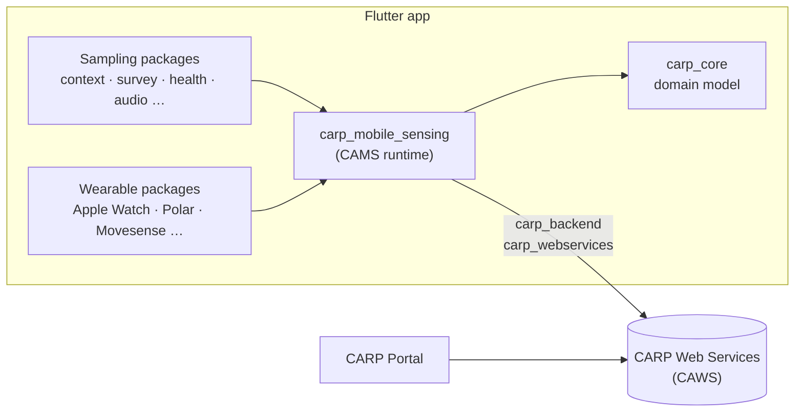
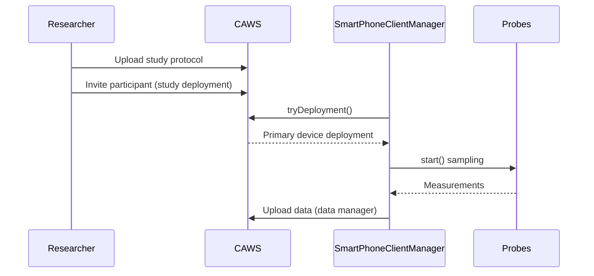

CARP is split into a platform-independent **domain model** (`carp_core`), a **client
framework** that runs studies on the phone (CARP Mobile Sensing, CAMS), pluggable
**sampling packages**, and **backends** that deploy studies and store data
(CARP Web Services, CAWS).

## Components

## Study lifecycle

## Where to go next

- [CAMS software architecture](/carp-mobile-sensing/software-architecture) – the runtime in detail
- [Domain model](/carp-mobile-sensing/domain-model) – protocols, devices, triggers, tasks and measures
- [API Reference](/api-reference) – generated Dart docs on pub.dev
