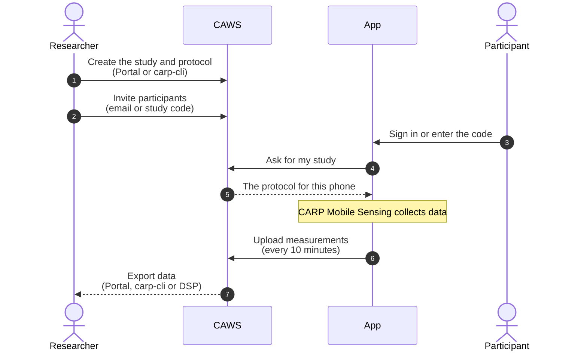

import { LinkCard, CardGrid } from '@astrojs/starlight/components';
import EcosystemMap from '../../../components/EcosystemMap.astro';

CARP is a set of building blocks. Most projects only need a few of them. Here's
how they connect.

## The short version

- **On the phone:** your Flutter app uses **CARP Mobile Sensing (CAMS)** to run a
  study. **Sampling packages** let CAMS collect more kinds of data (health, location,
  surveys…), and **wearable packages** let it talk to devices (Apple Watch, Polar…).
- **On the server:** **CARP Web Services (CAWS)** stores study protocols,
  deployments and the collected data. **Gardener** can add data from Fitbit, Garmin,
  Withings and Dexcom accounts.
- **For researchers:** the **CARP Portal** (web) and **carp-cli** (terminal, Python) set
  up studies and get data out of CAWS. **CARP DSP** runs data-science pipelines on it.

## Ecosystem map

<EcosystemMap />

Highlighted boxes are the parts every CAWS-based study uses. Click a box to open its docs. The phone and the server share
one domain model (protocols, devices, triggers, tasks, measures): **`carp_core`** in Dart and
**`carp.core-kotlin`** on the server. That is why a protocol made in the Portal runs unchanged in
the app. Without CAWS, only the phone part is needed: the protocol lives in your app code and
data stays on the phone or goes to [your own server](/backends/where-data-goes/own-server/).

Every package, with its repo and what it depends on, is listed in [Components](/start/components/).

## From study protocol to data

| Step in the diagram | Where it is covered |
| --- | --- |
| 1–2 | [Step 1: Define your protocol](/start/define-your-protocol/), [Go live](/start/run-your-study/go-live/) |
| 3–5 | [What participants see](/start/run-your-study/what-participants-see/) |
| after 5 (collecting) | [Measures and data](/carp-mobile-sensing/domain/measures-and-data/) |
| 6–7 | [Where data goes](/backends/where-data-goes/) |

## Where to go next

<CardGrid>
  <LinkCard title="Components" href="/start/components/" description="Every CARP piece with its repo, package and what it depends on." />
  <LinkCard title="CAMS architecture" href="/carp-mobile-sensing/architecture/" description="The phone runtime in detail." />
  <LinkCard title="Study protocol" href="/carp-mobile-sensing/domain/study-protocol/" description="Devices, triggers, tasks and measures, with examples." />
  <LinkCard title="API Reference" href="/api-reference/" description="Generated reference for every CARP Dart package." />
</CardGrid>
