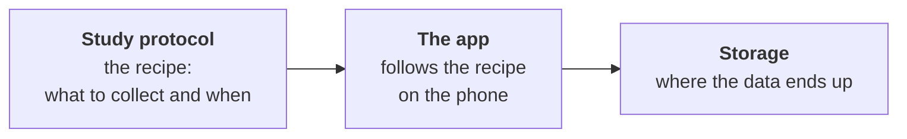

import { Aside, Card, CardGrid } from '@astrojs/starlight/components';

**CARP** (Copenhagen Research Platform) is a free, open-source toolkit for
**collecting data from phones and wearables**. New here? The [home page](/) has the short version and a video.

For example, imagine a researcher who wants to know how sleep affects mood. They need an app that
quietly counts steps, notices when the phone screen turns on at night, and asks the
participant *"How do you feel today?"* every morning. Then all that data must end up
somewhere safe where the researcher can analyse it.

Building all of that from scratch takes months. CARP gives you the building blocks
so you can do it in days.

## What can CARP collect?

<CardGrid>
  <Card title="Phone sensors" icon="mobile-android">
    Steps, location, activity (walking, running, still), screen on/off (Android), battery, light, noise.
  </Card>
  <Card title="Wearables" icon="heart">
    Heart rate and more from devices like Apple Watch, Polar and Movesense.
  </Card>
  <Card title="Questions" icon="comment">
    Surveys and questionnaires the participant fills in, plus small cognitive tests.
  </Card>
  <Card title="Health apps" icon="open-book">
    Data already stored in Apple Health or Google Health Connect.
  </Card>
</CardGrid>

## The three parts of CARP

You only need to remember three things:

1. **The study protocol** is a *recipe*. It says "collect steps and screen events,
   all the time" or "ask this survey every morning at 8:00".
2. **The app** runs on the participant's phone. It reads the recipe and does the
   collecting. The part of CARP that does this is called **CARP Mobile Sensing**
   (you'll see it shortened to **CAMS**).
3. **Storage** is where the data goes: kept on the phone, sent to CARP's own
   server (**CAWS**), or sent to a server you already have.

That's the whole idea. Everything else in these docs is detail.

## How you start

Every study follows the same two steps:

1. **[Configure your study](/start/configure-your-study/):** the protocol (what to collect, from which device, and when), the consent and the translations.
2. **[Run your study](/start/run-your-study/)** in the ready-made **CARP Studies app**: first on your own phone, then with participants.

No app code is needed. If you later need a new data type, your own server or your own app, see [Make it your own](/start/make-it-your-own/).

<Aside type="tip">
First, a few words you'll see: [the words you'll see](/start/key-concepts/).
</Aside>
