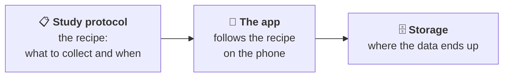

import { Aside, Card, CardGrid } from '@astrojs/starlight/components';

**CARP** (Copenhagen Research Platform) is a free, open-source toolkit for building
**mobile apps that collect data for research and health studies**.

Imagine a researcher who wants to know how sleep affects mood. They need an app that
quietly counts steps, notices when the phone screen turns on at night, and asks the
participant *"How do you feel today?"* every morning. Then all that data must end up
somewhere safe where the researcher can analyse it.

Building all of that from scratch takes months. CARP gives you the building blocks
so you can do it in days.

## What can CARP collect?

<CardGrid>
  <Card title="Phone sensors" icon="mobile-android">
    Steps, location, activity (walking, running, still), screen on/off (Android), battery, light, noise.
  </Card>
  <Card title="Wearables" icon="heart">
    Heart rate and more from devices like Apple Watch, Polar and Movesense.
  </Card>
  <Card title="Questions" icon="comment">
    Surveys and questionnaires the participant fills in, plus small cognitive tests.
  </Card>
  <Card title="Health apps" icon="open-book">
    Data already stored in Apple Health or Google Health Connect.
  </Card>
</CardGrid>

## The three parts of CARP

You only need to remember three things:

1. **The study protocol** is a *recipe*. It says "collect steps and screen events,
   all the time" or "ask this survey every morning at 8:00".
2. **The app** runs on the participant's phone. It reads the recipe and does the
   collecting. The part of CARP that does this is called **CARP Mobile Sensing**
   (you'll see it shortened to **CAMS**).
3. **Storage** is where the data goes: kept on the phone, sent to CARP's own
   server (**CAWS**), or sent to a server you already have.

That's the whole idea. Everything else in these docs is detail.

<Aside type="tip">
You don't have to decide everything now. The rest of this guide walks you through
it one step at a time. Next: [the words you'll see](/start/key-concepts/).
</Aside>
