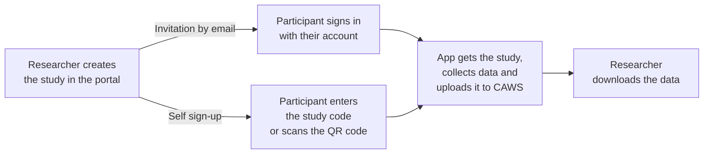

import { Aside, Steps, Tabs, TabItem } from '@astrojs/starlight/components';

**CAWS (CARP Web Services)** is CARP's own server. With CAWS, the *researcher*
does most of the work in a web browser, and the app mostly just signs in and follows
instructions.



Notice the difference from the on-phone setup: **the protocol lives on the server**,
not in the app. Researchers can change what's collected without releasing a new app.

## Two ways for participants to join

| | Invitation by email | Self sign-up with a code |
| --- | --- | --- |
| **How it works** | The researcher invites each person by email. They sign in with their own account. | The researcher turns on self sign-up and gets a 5-letter study code and a QR code. Anyone with the code can join. |
| **Participants are** | Known by email | Anonymous, no email or password needed |
| **Good for** | Studies where you need to know who is who | Classrooms, events and public studies, where many people join at once |
| **Limits** | One invitation per person | The researcher sets a maximum number of participants, and can turn sign-up off at any time |

## Getting access

To use CAWS you need access to the **CARP web portal**. Ask for it on
[Discord](https://discord.gg/PyxCmqS8) or [support@carp.dk](mailto:support@carp.dk).

- **DTU-affiliated researchers** can use the CAWS instance hosted by DTU Health Tech.
- **Everyone else** can run their own copy. CAWS is open source:
  [carp-webservices-spring](https://github.com/carp-dk/carp-webservices-spring).

<Aside type="tip">
Don't build your own app yet? The ready-made **CARP Studies app** is already connected
to CAWS, and supports both ways of joining. Many studies just use it. See [carp.dk](https://carp.dk).
</Aside>

## Connecting your own app

<Aside type="caution" title="Before you write code">
Ask the CAWS team ([Discord](https://discord.gg/PyxCmqS8) or [support@carp.dk](mailto:support@carp.dk)), or whoever runs your CAWS, to:

- **create your study**, with a protocol that sends data to CAWS,
- **invite a test participant** (you can invite yourself) or **turn on self sign-up**
  to get a study code, and
- **register your app** for sign-in. They'll give you a `clientId` and a `redirectURI`
  (plus an `anonymousRedirectURI` if you use study codes) to use below, and the redirect address must also be set up in your Android and iPhone
  project.

Without these, sign-in fails or there's no study to fetch. The
[CAMS demo app](https://github.com/carp-dk/carp.sensing-flutter/tree/main/apps/carp_mobile_sensing_app)
shows a complete working setup.
</Aside>

<Steps>

1. **Add the CAWS packages:**

   ```bash
   flutter pub add carp_webservices carp_backend
   ```

   On Android, these need a newer minimum version. In `android/app/build.gradle.kts`,
   set `minSdk = 26`.

2. **Point the app at the server and sign in.**

   ```dart
   import 'package:carp_webservices/carp_auth/carp_auth.dart';
   import 'package:carp_webservices/carp_services/carp_services.dart';
   import 'package:carp_backend/carp_backend.dart';

   // DTU's CAWS; use 'dev.carp.dk' while testing.
   final uri = Uri(scheme: 'https', host: 'carp.computerome.dk');

   await CarpAuthService().configure(
     CarpAuthProperties(
       authURL: uri,
       clientId: 'your-client-id',
       redirectURI: Uri.parse('your-app://auth'),
       anonymousRedirectURI: Uri.parse('your-app:/anonymous'), // only for study codes
       discoveryURL: uri.replace(pathSegments: ['auth', 'realms', 'Carp']),
     ),
   );
   CarpService().configure(CarpApp(name: 'My study app', uri: uri));
   ```

   Then sign the participant in, depending on how they joined:

   <Tabs>
   <TabItem label="Invitation by email">

   Shows the CARP login page, where the participant signs in with their account:

   ```dart
   await CarpAuthService().authenticate();
   ```

   </TabItem>
   <TabItem label="Study code">

   Let the participant type the code (or scan the QR code), then:

   ```dart
   final link = await CarpAuthService().magicLinkForCode('KXMTA');
   await CarpAuthService().authenticateWithMagicLink(link);
   ```

   This creates a new anonymous account for the participant and signs them in.
   The QR code holds a web address ending in `/api/self-signup/KXMTA`; the last
   part is the code.

   </TabItem>
   </Tabs>

3. **Turn on the CAWS services.** Enable fetching studies and uploading data:

   ```dart
   CarpParticipationService().configureFrom(CarpService());
   CarpDeploymentService().configureFrom(CarpService());
   DataManagerRegistry().register(CarpDataManagerFactory());
   ```

4. **Get the participant's study and start it.** Instead of writing a protocol in
   the app, ask CAWS which study this person has joined. This is the same for
   both ways of joining:

   ```dart
   final invitations =
       await CarpParticipationService().getActiveParticipationInvitations();
   if (invitations.isEmpty) return; // not part of any study yet

   final study = SmartphoneStudy.fromInvitation(invitations.first);

   final client = SmartPhoneClientManager();
   await client.configure(deploymentService: CarpDeploymentService());
   await client.addStudy(study);
   await client.tryDeployment(study.studyDeploymentId, study.deviceRoleName);
   client.resume();
   ```

</Steps>

Because the study's protocol says to send data to CAWS, the app now saves data on
the phone and uploads it automatically, every 10 minutes by default. If the phone
is offline, it waits until it's back online.

Full details: the [carp_backend package](https://pub.dev/packages/carp_backend).

More detail: [Data Managers → CAWS](/carp-mobile-sensing/data-managers/#carp-web-services).
