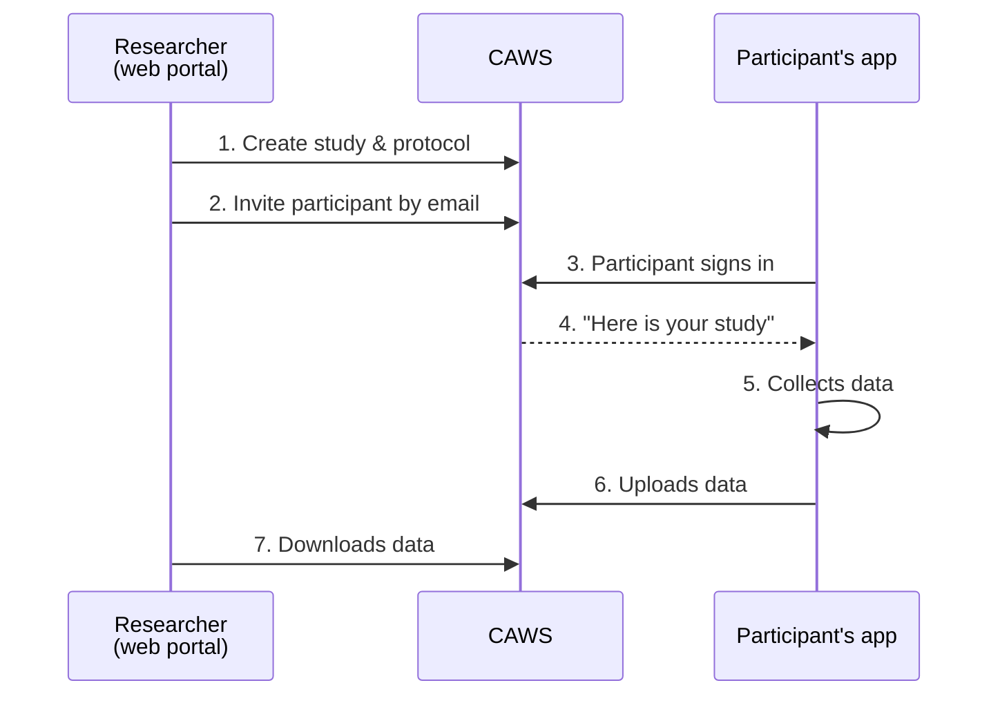

import { Aside, Steps } from '@astrojs/starlight/components';

**CAWS (CARP Web Services)** is CARP's own server. With CAWS, the *researcher*
does most of the work in a web browser, and the app mostly just signs in and follows
instructions.



Notice the difference from the on-phone setup: **the protocol lives on the server**,
not in the app. Researchers can change what's collected without releasing a new app.

## Getting access

To use CAWS you need access to the **CARP web portal**. Ask for it on
[Discord](https://discord.gg/PyxCmqS8) or [support@carp.dk](mailto:support@carp.dk).

- **DTU-affiliated researchers** can use the CAWS instance hosted by DTU Health Tech.
- **Everyone else** can run their own copy. CAWS is open source:
  [carp-webservices-spring](https://github.com/carp-dk/carp-webservices-spring).

<Aside type="tip">
Don't build your own app yet? The ready-made **CARP Studies app** is already connected
to CAWS. Many studies just use it. See [carp.dk](https://carp.dk).
</Aside>

## Connecting your own app

<Aside type="caution" title="Before you write code">
Ask the CAWS team ([Discord](https://discord.gg/PyxCmqS8) or [support@carp.dk](mailto:support@carp.dk)), or whoever runs your CAWS, to:

- **create your study**, with a protocol that sends data to CAWS,
- **invite a test participant** (you can invite yourself), and
- **register your app** for sign-in. They'll give you a `clientId` and a `redirectURI`
  to use below, and the redirect address must also be set up in your Android and iPhone
  project.

Without these, sign-in fails or there's no study to fetch. The
[CAMS demo app](https://github.com/carp-dk/carp.sensing-flutter/tree/main/apps/carp_mobile_sensing_app)
shows a complete working setup.
</Aside>

<Steps>

1. **Add the CAWS packages:**

   ```bash
   flutter pub add carp_webservices carp_backend
   ```

   On Android, these need a newer minimum version. In `android/app/build.gradle.kts`,
   set `minSdk = 26`.

2. **Point the app at the server and sign in.** This shows the participant
   the CARP login page:

   ```dart
   import 'package:carp_webservices/carp_auth/carp_auth.dart';
   import 'package:carp_webservices/carp_services/carp_services.dart';
   import 'package:carp_backend/carp_backend.dart';

   // DTU's CAWS; use 'dev.carp.dk' while testing.
   final uri = Uri(scheme: 'https', host: 'carp.computerome.dk');

   await CarpAuthService().configure(
     CarpAuthProperties(
       authURL: uri,
       clientId: 'your-client-id',
       redirectURI: Uri.parse('your-app://auth'),
       discoveryURL: uri.replace(pathSegments: ['auth', 'realms', 'Carp']),
     ),
   );
   CarpService().configure(CarpApp(name: 'My study app', uri: uri));

   await CarpAuthService().authenticate();
   ```

3. **Turn on the CAWS services.** Enable fetching studies and uploading data:

   ```dart
   CarpParticipationService().configureFrom(CarpService());
   CarpDeploymentService().configureFrom(CarpService());
   DataManagerRegistry().register(CarpDataManagerFactory());
   ```

4. **Get the participant's study and start it.** Instead of writing a protocol in
   the app, ask CAWS which study this person was invited to:

   ```dart
   final invitations =
       await CarpParticipationService().getActiveParticipationInvitations();
   if (invitations.isEmpty) return; // not invited to any study yet

   final study = SmartphoneStudy.fromInvitation(invitations.first);

   final client = SmartPhoneClientManager();
   await client.configure(deploymentService: CarpDeploymentService());
   await client.addStudy(study);
   await client.tryDeployment(study.studyDeploymentId, study.deviceRoleName);
   client.resume();
   ```

</Steps>

Because the study's protocol says to send data to CAWS, the app now saves data on
the phone and uploads it automatically, every 10 minutes by default. If the phone
is offline, it waits until it's back online.

Full details: the [carp_backend package](https://pub.dev/packages/carp_backend).

More detail: [Data Managers → CAWS](/carp-mobile-sensing/data-managers/#carp-web-services).
