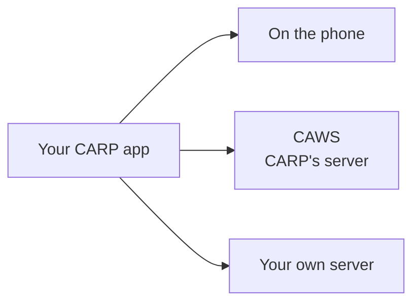

import { Aside, LinkCard, CardGrid } from '@astrojs/starlight/components';

Every study needs an answer to one question: **where do the measurements end up?**
CARP gives you three choices. You can start with one and switch later.

## Quick comparison

| | On the phone | CAWS | Your own server |
| --- | --- | --- | --- |
| **Good for** | Trying CARP, pilots, apps that never share data | Real research studies with many participants | Organisations that already have a data platform |
| **Server needed?** | No | Yes, CARP's (DTU-hosted or your own copy) | Yes, yours |
| **Invite participants & manage studies online** | No | Yes, in the CARP web portal, by email or with a study code | You build it |
| **Setup effort** | None, it's the default | Medium: request portal access ([Discord](https://discord.gg/PyxCmqS8) or [support@carp.dk](mailto:support@carp.dk)), then sign-in and a few lines of code | Depends on your server |
| **Researcher gets the data by** | Copying files off each phone | Downloading from the portal | Your own tools |

## How to choose

- **Just exploring, or building a demo?** → [On the phone](/start/storage-phone/).
  It's what your [first app](/start/first-app/) already does.
- **Running a real study with participants, and you're a researcher at DTU or a
  partner?** → [CAWS](/start/storage-caws/). You get study management, participant
  invitations and data download without building any server.
- **Your organisation already stores data somewhere (a hospital system, a company
  cloud)?** → [Your own server](/start/storage-own-server/).

<Aside type="tip">
Not sure? Start **on the phone**. Your measures and your app's screens can be reused
when you move on later. CAWS adds a sign-in step and moves the protocol to the server.
</Aside>

<CardGrid>
  <LinkCard title="Keep data on the phone" href="/start/storage-phone/" />
  <LinkCard title="Use CAWS" href="/start/storage-caws/" />
  <LinkCard title="Use your own server" href="/start/storage-own-server/" />
</CardGrid>
