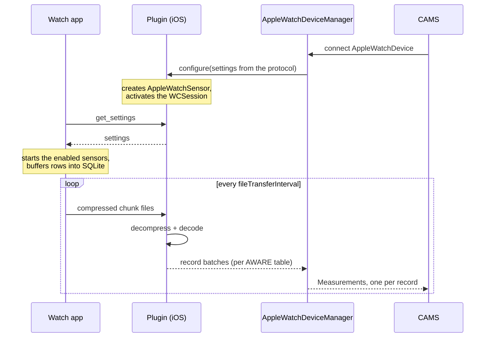

This page follows one data point all the way through the system. It covers
nearly every aspect of this package (delayed arrival, bursts,
data appearing while the app was closed).

## The layers

| Layer | Runs on | What it does |
|---|---|---|
| AWARE sensors | Watch | Read the hardware, write rows into a SQLite database on the watch |
| Companion watch app | Watch | Decides which sensors run, based on settings from the phone |
| `WatchConnectivity` | Both | Apple's transport between a watch and its paired phone |
| `AppleWatchController` (Swift) | Phone | Owns the AWARE `AppleWatchSensor`, answers the watch's settings request, forwards decoded records |
| `CarpAwarePlugin` (Swift) | Phone | Exposes the above to Dart over three platform channels |
| `AppleWatchService` (Dart) | Phone | The Dart side of those channels — records, status, transfer progress |
| `AppleWatchDeviceManager` (Dart) | Phone | CAMS device manager: connects, tracks state, fans records out |
| Probes (Dart) | Phone | One per measure type; turns records into CAMS `Measurement`s |

### 1. Watch configuration

When CAMS connects the `AppleWatchDevice`, the device manager calls `configure` with the
settings from the protocol. On the phone this creates the AWARE `AppleWatchSensor`, which
activates the `WatchConnectivity` session. The watch app asks the phone for its configuration 
on startup (and whenever it calls `applyiPhoneSettings()`). The phone answers with the 
settings derived from `AppleWatchDevice.toWatchSettings()`.

The exact keys are listed in [Settings Sent to the Watch](/wearables/apple-watch/reference/watch-settings).

### 2. Watch database

The AWARE sensors write rows into a SQLite database on the watch. This happens whether
or not the phone is nearby, and whether or not your Flutter app is running. The only
requirement is that the watch app holds a background runtime session (see
[`backgroundSessionType`](/wearables/apple-watch/concepts/configuration)).

### 3. Data transfer

On a timer, `fileTransferInterval`, 15 minutes by default, the watch exports the
database in pages, compresses each page with zlib, and sends each as a file over
`WatchConnectivity`.

### 4. Phone decoding

The AWARE sensor on the phone decompresses and decodes each file into raw AWARE rows.
`AppleWatchController` receives them tagged with the AWARE table they came from, and
sends each batch over the `records` platform channel as an `AppleWatchRecords`.

### 5. Probes

`AppleWatchDeviceManager` re-broadcasts the batches. Every probe listens to the same
stream and takes only the records from the AWARE table that holds its own data type:

| AWARE table | Measure type |
|---|---|
| `ios_watch_motion` | `dk.carp.watch.aware.motion` |
| `ios_watch_heart_rate` | `dk.carp.watch.aware.heartrate` |
| `ios_watch_battery` | `dk.carp.watch.aware.battery` |
| `ios_watch_location` | `dk.carp.watch.aware.location` |
| `ios_watch_heading` | `dk.carp.watch.aware.heading` |
| `ios_watch_bluetooth` | `dk.carp.watch.aware.bluetooth` |
| `ios_watch_ambient_noise` | `dk.carp.watch.aware.ambientnoise` |
| `ios_watch_audio_label` | `dk.carp.watch.aware.audiolabel` |
| `ios_watch_device` | `dk.carp.watch.aware.device` |

## Platform channels

For anyone extending the package or building a debug screen:

| Channel | Type | Carries |
|---|---|---|
| `carp_aware_package/methods` | Method | `configure`, `status`, `exchangeDeviceId`, `close` |
| `carp_aware_package/records` | Event | Batches of decoded records from the watch |
| `carp_aware_package/events` | Event | Connection status changes and file transfer progress |

The Dart side of all three is `AppleWatchService`, a singleton described in the
[API Reference](/wearables/apple-watch/reference/api).
